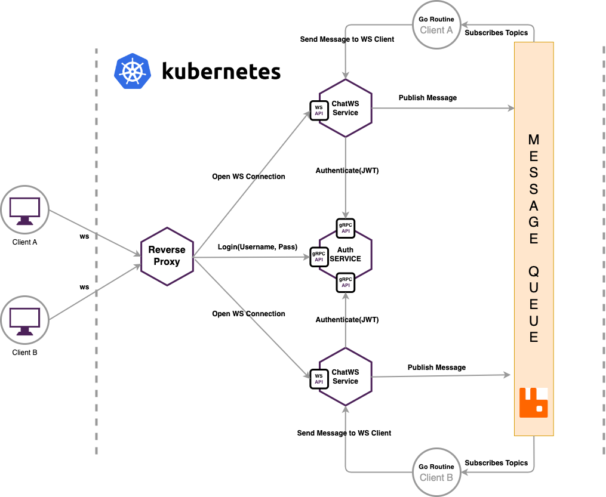

# ChatWS

ChatWS is a WebSocket server that handles real-time communication between users via websockets protocol. It allows users to send messages to each other and subscribe to specific topics in order to receive updates.



## Features

* JWT Authentcation
* Clients chat and broadcast
* Subscribe clients to specific topics

# Installation and Deployemnt

## Install RabbitMQ using Helm Chart
```bash
helm install rabbitmq \
  --set auth.username=admin,auth.password=secretpassword,auth.erlangCookie=secretcookie \
    oci://registry-1.docker.io/bitnamicharts/rabbitmq
```

## Build Code and Run Unit Tests using Docker
```bash
docker build -t yourrepository/chatws:v1 .
```

## Register Container Image
```bash
docker push yourrepository/chatws:v1
```

## Deploy Container in Kubernetes using Helm Chart
```bash
helm install chatws ./helm/chatws
```

## Run a Deployment in Kubernetes Local Dev Enviroment using Skaffold
```bash
skaffold run
```

## Usage & Example
### Golang Client
```go
package main

import (
	"context"
	"flag"
	"fmt"
	"log"
	"net/url"
	"strings"
	"time"

	"github.com/gorilla/websocket"
	"google.golang.org/grpc"

	pb "github.com/mig-elgt/chatws/auth/proto/auth"
)

func main() {
	addr := flag.String("addr", "localhost:8080", "http service address")
	username := flag.String("username", "foo", "username")
	recipients := flag.String("recipients", "bar", "recipients IDs")
	topics := flag.String("topics", "", "client topics")
	authAddr := flag.String("auth", ":8080", "auth address service")
	flag.Parse()

	jwt := login(*username, *authAddr)

	u := url.URL{
		Scheme: "ws",
		Host:   *addr,
		Path:   "/ws",
	}

	conn, _, err := websocket.DefaultDialer.Dial(fmt.Sprintf("%v?topics=%v&jwt=%v", u.String(), *topics, jwt), nil)
	if err != nil {
		panic(err)
	}
	defer conn.Close()

	go func() {
		for {
			_, msg, err := conn.ReadMessage()
			if err != nil {
				fmt.Println(err)
				return
			}
			fmt.Println("got msg: ", string(msg))
		}
	}()

	ticker := time.NewTicker(time.Second)
// Client Message Chat Format
// {
//     "kind": "chat"
//     "message": "Hello there..."
//     "recipient": "username"
// }
	defer ticker.Stop()
	for {
		select {
		case <-ticker.C:
			clients := strings.Split(*recipients, ",")
			for _, clientId := range clients {
				msg := []byte(fmt.Sprintf(`{"kind":"chat","message":"Hello there, I am %v","recipient":"%v"}`, *username, clientId))
				err := conn.WriteMessage(websocket.TextMessage, msg)
				if err != nil {
					log.Println("write:", err)
					return
				}
			}
		}
	}
}

func login(username, authAddr string) string {
	conn, err := grpc.Dial(authAddr, grpc.WithInsecure())
	if err != nil {
		log.Fatalf("could not get connection to address %s: %v", authAddr, err)
	}
	client := pb.NewAuthServiceClient(conn)
	resp, err := client.Login(context.Background(), &pb.LoginRequest{Username: username})
	if err != nil {
		panic(err)
	}
	return resp.JWT
}
```
